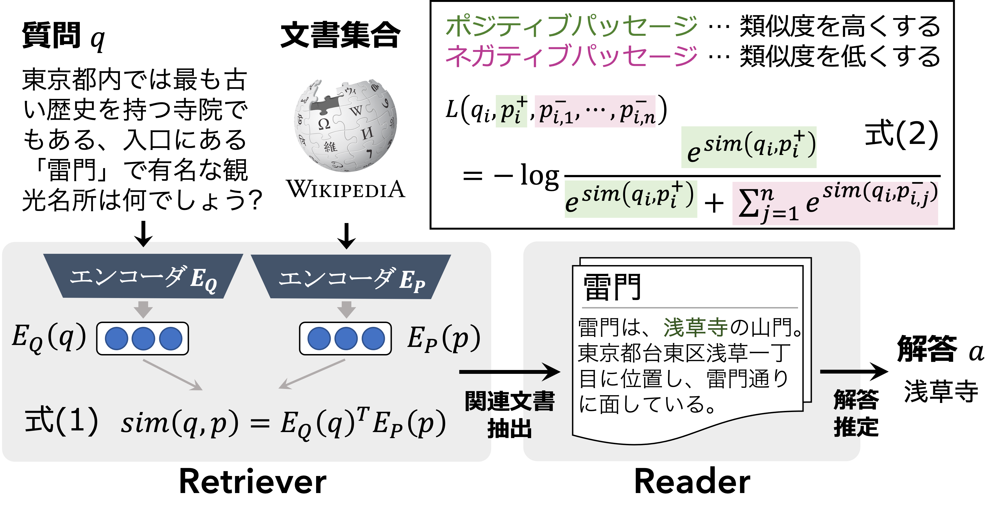

# AI王 〜クイズAI日本一決定戦〜 2021


オープンドメイン質問応答
- [AI王 〜クイズAI日本一決定戦〜](https://www.nlp.ecei.tohoku.ac.jp/projects/aio/)
- 昨年度の概要は [こちら](https://sites.google.com/view/nlp2021-aio/)


### 目次
- [環境構築](#環境構築)
- [データセット](#データセット)
    - ダウンロード
    - 学習データ
    - 文書集合（Wikipedia）
- [Dense Passage Retrieval](#dense-passage-retrieval)
    - 設定
    - Retriever
        1. 学習
        2. 文書集合のエンコード
        3. データセットの質問に関連する文書抽出
    - Reader
        4. hoge
        5. 

## 環境構築

```bash
$ pip install pip-tools
$ pip-compile requirements.in
$ pip-sync
```

## データセット

> __JAQKET: クイズを題材にした日本語QAデータセット__
> - https://www.nlp.ecei.tohoku.ac.jp/projects/jaqket/
> - 鈴木正敏, 鈴木潤, 松田耕史, ⻄田京介, 井之上直也. JAQKET:クイズを題材にした日本語QAデータセットの構築. 言語処理学会第26回年次大会(NLP2020) [\[PDF\]](https://www.anlp.jp/proceedings/annual_meeting/2020/pdf_dir/P2-24.pdf)


### ダウンロード

```bash
$ bash scripts/download_data.sh <output_dir>

<output_dir>
|- wiki/
|  |- jawiki-20210503-paragraphs.tsv
|- aio/
|  |- abc_eqiden_01-12.json
|  |- dev_jaqket.json
|  |- test_jaqket.json
```

|データ|質問数|
|:---|---:|
|訓練||
|開発||
|評価||
|wiki|6795533|


### 学習データ

以下の例に示した要素からなるリスト型の JSON ファイル
- `question`：質問
- `answers`：答えのリスト
- `positive_ctxs`：正例文書。以下の辞書で構成されたリスト形式。
    - `id`：文書インデックス
    - `title`：Wikipedia のタイトル
    - `text`：Wikipedia の記事 
- `negative_ctxs`：負例文書（学習中に再定義される）
- `hard_negative_ctxs`: ハード負例文書。`positive_ctxs` と同様の形式。

```json
{
    "question": "明治時代に西洋から伝わった「テーブル・ターニング」に起源を持つ占いの一種で、50音表などを記入した紙を置き、参加者全員の人差し指をコインに置いて行うのは何でしょう?",
    "answers": [
        "コックリさん"
    ],
    "positive_ctxs": [
        {
            "id": 278397,
            "title": "コックリさん",
            "text": "コックリさん(狐狗狸さん)とは、西洋の「テーブル・ターニング(Table-turning)」に起源を持つ占いの一種。机に乗せた人の手がひとりでに動く現象は心霊現象だと古くから信じられていた。科学的には意識に関係なく体が動くオートマティスムの一種と見られている。「コックリさん」と呼ばれるようになったものは、日本で19世紀末から流行したものだが、これは「ウィジャボード」という名前の製品が発売されたりした海外での流行と同時期で、外国船員を通して伝わったという話がある。"
        }
    ],
    "negative_ctxs": [],
    "hard_negative_ctxs": [
        {
            "id": 3943003,
            "title": "星座占い",
            "text": "喫茶店などのテーブル上には、星座占いの機械が置かれていることがある。硬貨を投入して、レバーを動かすと、占いの内容が印刷された用紙が排出される。"
        },
    ]
}
```

### 文書集合（Wikipedia）

- 以下のアイテムで構成される TSV 形式のデータ（2021.05.03 時点のものを使用）
    - `id`：文書インデックス
    - `text`：Wikipedia の記事
    - `title`：Wikipedia のタイトル

```tsv
id      text    title
1       "モルガナイト(morganite)はピンク色ないし淡赤紫色の緑柱石(ベリル)である。呈色はマンガン(Mn)に由来する。" モルガナイト
```


## Dense Passage Retrieval

本実装では、オープンドメイン質問応答に取り組むための二つのモジュールを学習する<br>
1. 与えられた質問に対して、文書集合から関連する文書を検索するモジュール（Retriever）
2. 検索した関連文書の中から質問の答えとなる箇所を特定するモジュール（Reader）



より詳細な解説は、以下を参照して下さい。

> Karpukhin, Vladimir and Oguz, Barlas and Min, Sewon and Lewis, Patrick and Wu, Ledell and Edunov, Sergey and Chen, Danqi and Yih, Wen-tau. Dense Passage Retrieval for Open-Domain Question Answering (EMNLP2020) [\[paper\]](https://www.aclweb.org/anthology/2020.emnlp-main.550) [\[github\]](https://github.com/facebookresearch/DPR)

### 設定

```bash
$ vim scripts/configs/config.pth
```

- 実装を始める前に以下の項目を設定して下さい。
    - `WIKI_FILE`：Wikipedia の文書ファイル
    - `TRAIN_FILE`：訓練セット
    - `DEV_FILE`：開発セット
    - `TEST_FILE`：評価セット
    - `DIR_DPR`：モデルやエンベッディングの保存先
 

### Retriever

#### 1. 学習
- [scripts/retriever/train_retriever.sh](scripts/retriever/train_retriever.sh)

```bash
# 実行例

$ exp_name="baseline"
$ config_file="scripts/configs/retriever_base.json"

$ bash scripts/retriever/train_retriever.sh \
    -n $exp_name \
    -c $config_file
```

#### 2. 文書集合のエンコード
- [scripts/retriever/encode_ctxs.sh](scripts/retriever/encode_ctxs.sh)

```bash
# 実行例

$ exp_name="baseline"
$ model_file="path/to/model"

$ bash scripts/retriever/encode_ctxs.sh \
    -n $exp_name \
    -m $model
```

#### 3. データセットの質問に関連する文書抽出
- [scripts/retriever/retrieve_passage.sh](scripts/retriever/retrieve_passage.sh)

```bash
# 実行例

$ exp_name="baseline"
$ model="path/to/model"
$ embed="path/to/embeddings"

$ bash scripts/retriever/retrieve_passage.sh \
    -n $exp_name \
    -m $model \
    -e $embed
```

### Reader

#### 4. 学習

```bash
```
