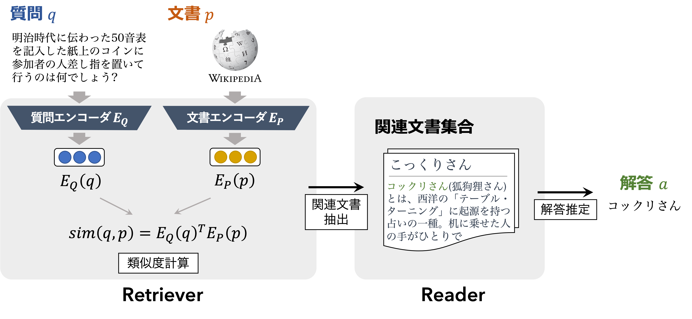
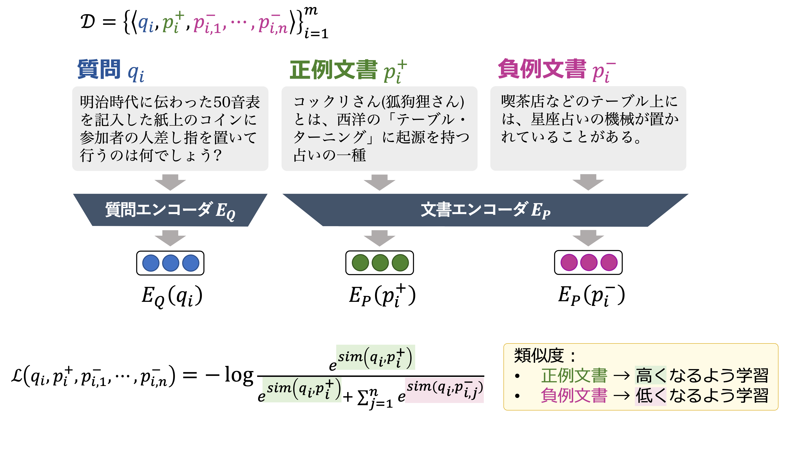

- [AI王 〜クイズAI日本一決定戦〜](https://www.nlp.ecei.tohoku.ac.jp/projects/aio/)
- 昨年度の概要は [こちら](https://sites.google.com/view/nlp2021-aio/)

## 目次
以下に記した実行手順の一連の流れについては、[./do_example_run.sh](./do_example_run.sh) に記載していますので、こちらもご確認下さい。

- [環境構築](#環境構築)
- [データセット](#データセット)
    - ダウンロード
    - 学習データ
    - 文書集合（Wikipedia）
- [Dense Passage Retrieval](#dense-passage-retrieval)
    - ダウンロード
    - 設定
    - Retriever
        - 1. BiEncoder の学習
        - 2. 文書集合のエンコード
        - 3. データセットの質問に関連する文書抽出
    - Reader
        - 4. Reader の学習
        - 5. 評価


## 環境構築
- cuda バージョンに合わせて、以下より torch をインストールして下さい。
  - [https://pytorch.org](https://pytorch.org)
- fp16 を使用する場合は、以下より apex をインストールして下さい。
  - [https://github.com/NVIDIA/apex](https://github.com/NVIDIA/apex)
- その他のライブラリについては以下のコマンドを実行してインストールして下さい。

```bash
$ pip install -r requirements.txt
```

## データセット

- 訓練データには、クイズ大会[「abc/EQIDEN」](http://abc-dive.com/questions/) の過去問題に対して Wikipedia の記事段落の付与を自動で行ったものを使用しています。
- 開発・評価用クイズ問題には、[株式会社キュービック](http://www.qbik.co.jp/) および [クイズ法人カプリティオ](http://capriccio.tokyo/) へ依頼して作成されたものを使用しています。

- 以上のデータセットの詳細については、[AI王 〜クイズAI日本一決定戦〜](https://www.nlp.ecei.tohoku.ac.jp/projects/aio/)の公式サイト、および下記論文をご覧下さい。

> __JAQKET: クイズを題材にした日本語QAデータセット__
> - https://www.nlp.ecei.tohoku.ac.jp/projects/jaqket/
> - 鈴木正敏, 鈴木潤, 松田耕史, ⻄田京介, 井之上直也. JAQKET:クイズを題材にした日本語QAデータセットの構築. 言語処理学会第26回年次大会(NLP2020) [\[PDF\]](https://www.anlp.jp/proceedings/annual_meeting/2020/pdf_dir/P2-24.pdf)


### ダウンロード

```bash
$ bash scripts/download_data.sh <output_dir>

<output_dir>
|- wiki/
|  |- jawiki-20210503-paragraphs.tsv.gz
|- aio/
|  |- abc_01-12_retriever.json.gz      # 訓練セット
|  |- aio_01_dev_retriever.json.gz     # 開発セット
|  |- aio_01_test_retriever.json.gz    # 評価セット
|  |- aio_01_unused_retriever.json.gz

# 「質問」と「正解」からなる TSV 形式のファイル
|  |- abc_01-12_retriever.tsv      # 訓練セット
|  |- aio_01_dev_retriever.tsv     # 開発セット
|  |- aio_01_test_retriever.tsv    # 評価セット
|  |- aio_01_unused_retriever.tsv
```

|データ|ファイル名|質問数|文書数|
|:---|:---|---:|---:|
|訓練|abc\_01-12\_retriever|17,735|-|
|開発|aio\_01\_dev\_retriever|1,992|-|
|評価|aio\_01\_test\_retriever|2,000|-|
|未使用|aio\_01\_unused\_retriever|608|-|
|文書集合|jawiki-20210503-paragraphs|-|6,795,533|

- データセットの構築方法の詳細については、[data/README.md](data/README.md)を参照して下さい。

### 学習データ

以下の例に示した要素からなるリスト型の JSON ファイル
- `question`：質問
- `answers`：答えのリスト
- `positive_ctxs`：正例文書（答えを含む文書）。以下の辞書で構成されたリスト形式。
    - `id`：文書インデックス
    - `title`：Wikipedia のタイトル
    - `text`：Wikipedia の記事
- `negative_ctxs`：負例文書（インバッチネガティブ：ミニバッチ内の他の質問に対する正例文書）。学習中に定義される。
- `hard_negative_ctxs`: ハード負例文書（質問に類似するが答えを含まない文書。）。`positive_ctxs` と同様の形式。

```json
{
    "question": "明治時代に西洋から伝わった「テーブル・ターニング」に起源を持つ占いの一種で、50音表などを記入した紙を置き、参加者全員の人差し指をコインに置いて行うのは何でしょう?",
    "answers": [
        "コックリさん"
    ],
    "positive_ctxs": [
        {
            "id": 278397,
            "title": "コックリさん",
            "text": "コックリさん(狐狗狸さん)とは、西洋の「テーブル・ターニング(Table-turning)」に起源を持つ占いの一種。机に乗せた人の手がひとりでに動く現象は心霊現象だと古くから信じられていた。科学的には意識に関係なく体が動くオートマティスムの一種と見られている。「コックリさん」と呼ばれるようになったものは、日本で19世紀末から流行したものだが、これは「ウィジャボード」という名前の製品が発売されたりした海外での流行と同時期で、外国船員を通して伝わったという話がある。"
        }
    ],
    "negative_ctxs": [],
    "hard_negative_ctxs": [
        {
            "id": 3943003,
            "title": "星座占い",
            "text": "喫茶店などのテーブル上には、星座占いの機械が置かれていることがある。硬貨を投入して、レバーを動かすと、占いの内容が印刷された用紙が排出される。"
        },
    ]
}
```

### 文書集合（Wikipedia）

- 以下のアイテムで構成される TSV 形式のデータ（2021.05.03 時点のものを使用）
    - `id`：文書インデックス
    - `text`：Wikipedia の記事
    - `title`：Wikipedia のタイトル

```tsv
id      text    title
1       "モルガナイト(morganite)はピンク色ないし淡赤紫色の緑柱石(ベリル)である。呈色はマンガン(Mn)に由来する。" モルガナイト
```


## Dense Passage Retrieval

本実装では、オープンドメイン質問応答に取り組むための二つのモジュールを学習する<br>
1. 与えられた質問に対して、文書集合から関連する文書を検索するモジュール（Retriever）
2. 検索した関連文書の中から質問の答えとなる箇所を特定するモジュール（Reader）



より詳細な解説は、以下を参照して下さい。

> Karpukhin, Vladimir and Oguz, Barlas and Min, Sewon and Lewis, Patrick and Wu, Ledell and Edunov, Sergey and Chen, Danqi and Yih, Wen-tau. Dense Passage Retrieval for Open-Domain Question Answering (EMNLP2020) [\[paper\]](https://www.aclweb.org/anthology/2020.emnlp-main.550) [\[github\]](https://github.com/facebookresearch/DPR)

### ダウンロード
本節以降では Retriever と Reader の学習手順、および Retriever による文書エンベッディングの作成と関連文書検索方法について紹介します。
本節は以降の手順で作成された、Retriever、Reader、文書エンベッディングのダウンロード方法について説明します。
必要に応じてダウンロードして下さい。
2021/12/24 更新：訓練済みモデルのtransformerのバージョンを、2.11.0から4.12.5に変更しました。少なくとも第2回のベースラインとしては，このバージョンで固定します。
```bash
$ save_dir="model"
$ targets="retriever,reader,embeddings"  # {retriever, reader, embeddings} からダウンロード対象を「スペースなしの ',' 区切り」で指定して下さい

$ bash scripts/download_model.sh $targets $save_dir
$ du -h ${save_dir}/*
  2.2G    biencoder.pt.gz
  1.1G    reader.pt.gz
  18.0G   embedding.pickle.gz
```

### 設定

```bash
$ vim scripts/configs/config.pth
```

- 実装を始める前に以下の項目を設定して下さい。
    - `WIKI_FILE`：Wikipedia の文書ファイル
    - `TRAIN_FILE`：訓練セット
    - `DEV_FILE`：開発セット
    - `TEST_FILE`：評価セット
    - `DIR_DPR`：モデルやエンベッディングの保存先


### Retriever



#### 1. BiEncoder の学習
質問と文書の類似度を計算するため、質問エンコーダおよび文書エンコーダで構成される BiEncoder を学習します。デフォルトのパラメータでは、4GPU (Tesla V100-SXM2-16GB) を用いて6時間程度の学習時間を要しました。
- [scripts/retriever/train_retriever.sh](scripts/retriever/train_retriever.sh)

```bash
# 実行例

$ exp_name="baseline"
$ config_file="scripts/configs/retriever_base.json"

$ bash scripts/retriever/train_retriever.sh \
    -n $exp_name \
    -c $config_file

# 実行結果

$ ls $DIR_DPR/$exp_name/retriever
    dpr_biencoder.*.*.pt            # モデルファイル
    hps.json                        # パラメータ
    score_train_retriever_*.jsonl   # 訓練時スコアログ
    logs/
      run_*.sh                      # 実行時シェルスクリプト
      train_*.log                   # 実行時ログ
    tensorboard/                    # tensorboard ログディレクトリ (if `--tensorboard_logdir`)
```

#### 2. 文書集合のエンコード
質問と文書の類似度を計算する前に、文書集合（Wikipedia）を文書エンコーダでエンコードします。エンコードには、4GPU (Tesla V100-SXM2-16GB) を用いて3時間程度の実行時間を要しました。
- [scripts/retriever/encode_ctxs.sh](scripts/retriever/encode_ctxs.sh)

```bash
# 実行例

$ exp_name="baseline"
$ model_file="path/to/model"

$ bash scripts/retriever/encode_ctxs.sh \
    -n $exp_name \
    -m $model

# 実行結果

$ ls $DIR_DPR/$exp_name/embeddings
    emb_${model}.pickle             # 文書エンベッディング
    logs/
      embs_*.log                    # 実行時ログ
```

#### 3. データセットの質問に関連する文書抽出
データセットの質問に関連する文書を抽出します。質問エンコーダから取得した質問エンベッディングと前項でエンコードした文書エンベッディングに対して Faiss を用いて類似度を計算します。
- [scripts/retriever/retrieve_passage.sh](scripts/retriever/retrieve_passage.sh)

```bash
# 実行例

$ exp_name="baseline"
$ model="path/to/model"
$ embed="path/to/embeddings"

$ bash scripts/retriever/retrieve_passage.sh \
    -n $exp_name \
    -m $model \
    -e $embed

# 実行結果
$ ls $DIR_DPR/$exp_name/retrieved
    train_*.*.json   dev_*.*.json   test_*.*.json   # 予測結果（reader 学習データ）
    train_*.*.tsv    dev_*.*.tsv    test_*.*.tsv    # 予測スコア（Acc@k を含む）
    logs/
      predict_*_*.log                               # 実行時ログ
```

__Acc@k__
- 抽出した上位 k 件までの文書に解答が含まれている質問数の割合

|データ|Acc@1|Acc@5|Acc@10|Acc@50|Acc@100|
|:---|---:|---:|---:|---:|---:|
|訓練セット|42.99|68.36|75.71|85.35|87.74|
|開発セット|36.30|60.44|69.33|85.34|89.21|
|評価セット|36.85|62.80|69.9|84.95|89.10|


### Reader

#### 4. Reader の学習
関連文書を用いて QA の読解モデルを学習します。学習には、4GPU (Tesla V100-SXM2-16GB) を用いて1時間程度の実行時間を要しました。
- [scripts/reader/train_reader.sh](scripts/reader/train_reader.sh)

```bash
# 実行例

$ exp_name="baseline"
$ config_file="scripts/configs/reader_base.json"
$ train_file="path/to/retrieved/train/file"
$ dev_file="path/to/retrieved/dev/file"

$ bash scripts/reader/train_reader.sh \
    -n $exp_name \
    -c $config_file \
    -t $train_file \
    -d $dev_file

# 実行結果

$ ls $DIR_DPR/$exp_name/reader
    dpr_reader.*.*.pt               # モデルファイル
    hps.json                        # パラメータ
    logs/
      run_*.sh                      # 実行時シェルスクリプト
      train_*.log                   # 実行時ログ
    results/                        # dev セットの評価結果の出力ディレクトリ
    tensorboard/                    # tensorboard ログディレクトリ (if `--tensorboard_logdir`)
```

#### 5. 評価
学習した読解モデルを評価します。
- [scripts/reader/eval_reader.sh](scripts/reader/eval_reader.sh)

```bash
# 実行例

$ exp_name="baseline"
$ test_file="path/to/retrieved/test/file"
$ model_file="path/to/reader/file"

$ bash scripts/reader/eval_reader.sh \
    -n $exp_name \
    -e $test_file \
    -m $model_file

$ ls $DIR_DPR/$exp_name/reader/results/
    test_prediction_resuls.json         # test セットの評価結果の出力ディレクトリ
    eval_accuracy.txt                   # 正解率 (Exact Match) の出力ファイル
```

__Accuracy__
- 上位 100 件の文書を用いた時の正解率 (Exact Match)

|データ|Acc|
|:---|---:|
|開発セット|56.93|
|評価セット|57.85|


※ __5. 評価__ で出力された eval_accuracy.txt を参照して下さい：

```bash
# 出力例
$ cat $DIR_DPR/$exp_name/reader/results/eval_accuracy.txt

### AIO2_DPR_baseline/outputs/baseline/retrieved/dev_jaqket_59.230.json
2021-10-12 11:28:17 #239 INFO __main__ :::  n=100       EM 56.93
```


## 謝辞・ライセンス

- 学習データに含まれるクイズ問題の著作権は [abc/EQIDEN 実行委員会](http://abc-dive.com/questions/) に帰属します。東北大学において研究目的での再配布許諾を得ています。
- 開発データは クリエイティブ・コモンズ 表示 - 継承 4.0 国際 ライセンスの下に提供されています。
  - 
- 開発/評価用クイズ問題は [株式会社キュービック](http://www.qbik.co.jp/) および [クイズ法人カプリティオ](http://capriccio.tokyo/) へ依頼して作成されたものを使用しております。
